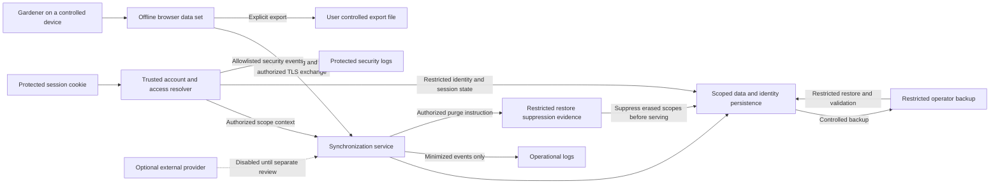

# Access data inventory and lifecycle

- Status: Accepted S1 inventory and lifecycle design, 2026-10-02.
- Authority: [ADR-0029](../architecture/decisions/0029-access-and-synchronization-scope.md) and
  [ADR-0015](../architecture/decisions/0015-privacy-and-observability.md).
- Implementation: S5 and S8-S15 of the
  [access plan](../development/access-and-synchronization-scope-implementation-plan.md), P0.6,
  and applicable deployment work. This inventory is not a deployment compliance finding.

## Classification and protection

Classify public installation capabilities and external catalog reference data as **public** when not
linked to a person. Classify garden/history/location data, user labels, account/device metadata,
bindings, stable identifiers, synchronization state, and linkable diagnostics as **personal**. Treat
passwords/hashes, session cookies, recovery/enrollment material, provider/backend credentials, and
private keys as **secret**. Encoding, pseudonymization, or removing names does not make linkable data
anonymous. Free-form content may contain unexpected sensitive information and is never logged.

Personal data requires authorized scope access, controlled local/device storage, TLS in deployment,
protected server volumes/backups, bounded lifecycle, and no disclosure to trackers or default external
providers. Secret data additionally needs narrow access and established cryptographic handling;
credentials never enter browser script storage, business exports, ordinary/security logs, or examples.
Production encryption/key-management choices and evidence belong to S8/S15 and deployment work.

## Data flow and recipients

Standalone data stays in the user's browser/device. After opt-in binding, recipients are the authorized
account's enrolled devices and the configured operator's server/storage infrastructure. Operator
administration has potential host/database access; application gardener roles do not automatically
grant cross-account access. Backup/support access is exceptional, documented, and restricted. The
project adds no Hortinis-operated account service, telemetry recipient, third-party runtime asset, or
mandatory email/identity provider. A provider's activation requires its own purpose, minimized payload,
recipients, location/transfers, terms, and lawful-basis review.

## Inventory and proposed lifecycle

ADR-0023's synchronization periods are accepted protocol policy. Other numeric periods below are
proposals for S8/S15/operator assessment; they are not activated defaults. A deployment must record its
effective values and justification, implement automatic purge, and close the blockers below before
real-data use. Account inactivity alone does not discard garden history or unresolved local intent.

| Category and fields | Purpose and location/recipients | Retention and deletion |
| --- | --- | --- |
| Garden content, corrections/history, approximate location when separately specified | Requested garden memory and synchronization; selected browser data set and authorized server scope/devices. Precise location is not required or newly authorized by S1. | Retain while the requested history service/data set continues; delete server copies on complete scope deletion and local copies on explicit local deletion. No automatic local age expiry or undocumented inactive-account purge. |
| Local data-set ID and binding: origin, instance, scope/account identity, mode, progress | Prevent accidental transfer and detect replacement/account changes; browser only except necessary authorized handshake fields. | Retain with the local data set and recovery provenance; remove on explicit data-set deletion. No credentials; disconnection does not infer a new owner. |
| Pending operations, bases, accepted results, conflicts, quarantined rejections, indeterminate work | Preserve offline intent and prove replay/reconciliation; selected local data set. May contain garden content. | Until resolved, explicitly discarded, or selected data set deleted; never expire pending intent by age. Completed state uses the implementing task's bounded cleanup while preserving recovery evidence. |
| Accepted browser live-record projection and legacy repair cursor | Preserve latest server values independently of pending intent; browser only, within the same data-set boundary. | Replace values monotonically; remove live accepted state on tombstones; delete with the data set. Repair metadata contains only scope/cursor state and is removed when repair completes. Never log values or cursors. |
| Submission markers and legacy uncertainty | Freeze operation bodies before dispatch and preserve replay after migration; browser only, with the outbox or retained rejection. | Retain with the operation and recovery evidence; no historical timestamp is invented for legacy rows. Never expose content in diagnostics. |
| Retry state and tab leases: work IDs, attempts, phase, ephemeral owner, fence, expiry | Bounded retry and coordination; browser only. | Retain active/exhausted work until outcome/manual recovery; Expire released leases while retaining one bounded scope row for fencing continuity. Delete with the data set; no copied request bodies or content in retry diagnostics. |
| Server instance/scope/account IDs and ownership relationship | Installation mismatch detection, partitioning, authorization; server, with minimum authorized identity exposed to binding. | Instance ID follows installation lifecycle; account/scope IDs and ownership last until deletion. Never reuse; public discovery omits account/scope identity. |
| Account login identifier and credential verifier; recovery attributes only if justified by S8 | Autonomous authentication/recovery; restricted identity storage. Do not require an email address or external provider by assumption. | Account lifetime, then purge during deletion. Superseded verifiers/secrets follow bounded S8 cleanup; do not archive obsolete credentials in ordinary account tables. |
| Session records/cookies, CSRF and bootstrap/recovery/enrollment secrets | Authentication and request/replay protection; restricted server records and protected necessary cookie/in-memory token handling. | Enforce S8's finite idle/absolute/one-time limits; invalidate at logout, revocation, disablement, or deletion. S8 specifies bounded physical cleanup; termination immediately removes authorization. Never store session secrets in IndexedDB/localStorage/sessionStorage. |
| Device ID, enrollment status, optional user label, justified activity timestamps | User-visible device management/revocation; account identity store and authorized account UI. No fingerprinting or precise location. | Active enrollment lifetime; revoke immediately and purge obsolete metadata under a bounded S11/S15 rule. Purge on account deletion; labels are never logged. |
| Active-generation changes/tombstones and retired-generation receipts | Ordered synchronization and acceptance proof; authorized scope. Payloads may contain former garden values. | ADR-0023: default 90 days active history, 30 days retired receipts; supported minimum 7 days each. Rollover precedes compaction; scope deletion overrides retention and purges them. |
| Snapshot/reconciliation sessions | Anchored, resumable reconciliation; authorized temporary server/browser state. | ADR-0023: default 24 hours, minimum 1 hour. Purge automatically after expiry/completion under accepted cleanup rules; scope deletion purges immediately through its workflow. |
| Retired record-identifier reservations | Prevent stale resurrection; authorized server scope, no former record values. | Scope lifetime under ADR-0024; purge when the scope is destroyed. Never recreate that scope/record ownership from stale client input. |
| Operational events: UTC time, fixed event/method/route template, status, duration, fresh request/trace reference | Availability diagnosis; operator-controlled logging. Treat linkable event references as personal metadata. | Proposed rolling 30 days, with purpose justification and automatic rotation/purge in S15. No bodies, credentials, stable account/scope/device/record/operation IDs, raw addresses, concrete routes, or query values. |
| Security events: UTC time, fixed event/outcome/reason, request reference, justified factor/device-type enum, optional purpose-limited pseudonymous subject reference | Detect/investigate authentication/authorization abuse; separate restricted security store. No raw session/account/scope/device IDs or attempted login strings. | Proposed rolling six months for documented security investigation; S15 accepts a purpose-specific period. Purge subject mappings when no longer needed, including deletion assessment; legal holds require narrow documented scope/expiry. |
| Network source addresses and transient abuse counters | Establish connections and defend against excessive attempts; infrastructure/resolver memory with trusted proxy handling. | Process transiently; no raw IP persistence in application/proxy logs. S8/S15 specifies bounded limiter keys/windows and their privacy inventory before use. No durable tracking or account analytics. |
| Server backups, volume/database snapshots and protected operational restoration copies | Recover installation data; restricted operator storage. May contain every backed-up personal/secret category. | Proposed maximum rolling 30 days, subject to justified operator choice in P0.6/S15. Encrypt/restrict access; purge expiry; suppress deleted accounts/scopes before serving any restored copy. Backups are not an indefinitely retained archive. |
| Purge progress and minimal restore-suppression evidence: deleted opaque identity, deletion time/status, affected backup boundary | Resume erasure and prevent restoration resurrection; restricted store protected from rollback with affected backups. | Until purge completes and all affected backups expire or are erased, then purge automatically. No garden content or credentials; retain longer only under a specific documented legal obligation/hold. |
| User business-data export | Requested portability/backup; explicit user-controlled file. | Never include session/recovery/backend secrets. User controls exported-copy retention; disclose that server/local deletion cannot retrieve all exports. Version/restore semantics belong to P0.6. |
| Public catalog/capabilities | Offline reference facts and compatibility discovery. | Reference-data version policy; not personal in isolation. A personal plant selection or account-bound capability response inherits personal classification. |

## Complete deletion and restoration

S2 refines metadata representations without activating new processing: local version-one binding and
exchange fences remain browser-only, public discovery excludes account/scope identity, and authorized
bootstrap exposes only the required destination identity. The non-secret exchange expectation is
transient, excluded from local binding persistence and all logs. S6 must specify its bounded handshake
lifecycle and purge before persisting it. S2 fixed errors expose no identity or content and declare
`Cache-Control: no-store`; actual transport/caching behavior remains adapter evidence. All parsing
fixtures are synthetic. See [access contracts](../api/access-and-binding-contracts.md).

Separate account closure from scope erasure, local browser deletion, and user-managed export disposal.
Explain these boundaries before confirmation. Offer export and identify the destination being deleted;
do not make keeping a backup a prerequisite to exercising deletion rights.

The [access specification](../architecture/access-and-synchronization-scope.md) defines the ordered
deny/revoke/purge workflow. The server first blocks access atomically, then purges all categories through
idempotent steps. Purge failure remains denied, resumable, and visible to the operator. Account deletion
must not retain tombstone/reservation identifiers forever simply to preserve a destroyed scope.

Preserve minimal deletion instructions independently of backup rollback. Restore into an inaccessible
environment, apply those instructions, invalidate stale session/enrollment credentials, establish the
new installation identity for rolled-back state, and verify authentication mode before serving. If
deletion evidence cannot be established, restored data remains inaccessible pending controlled
recovery. Test restores from backups taken before and during deletion.

Browser deletion fences tabs and in-flight responses and removes the selected data set and its work.
Explain that browser/OS caches, device backups, flash storage, extensions, and user exports prevent a
guarantee of secure physical erasure. Account revocation cannot remotely wipe a disconnected device.
Sign-out retains local garden access by the accepted product decision; disclose shared-profile risks.

## Controller/operator processing record and user information

The operator documents the actual controller/processor roles, GDPR applicability, recipients, and any
household-use exception assessment. Installing self-hosted software does not automatically settle
those roles. The project supplies code/design guidance, not a universal lawful-basis determination.

Before a deployment stores real personal data, complete a processing-purpose record with: operator
identity/contact and privacy contact; data subjects/categories; each purpose; Article 6 lawful-basis
decision and assessment; necessary attributes; recipients/processors/contracts and transfers; storage
locations; actual retention/backup periods; safeguards; rights channel; legal holds; and accountable
review date/owner. No placeholder, default consent, or undefined basis authorizes processing.

Publish accessible information distinguishing local-only use from server binding: who operates the
server, what data is sent, access-mode limits, providers and transfers, cookies, retention, backups,
rights/contact/complaint route, local retention after sign-out/revocation, export/deletion limits, and
changes in processing. Necessary session cookies have a documented functional purpose; provider and
analytics activation still require their own accepted information/legal gates.

## Rights handling, incidents, and DPIA screening

Provide an operator procedure for receiving, verifying, and tracking applicable access, rectification,
erasure, restriction, objection, and portability requests. Verify identity proportionately without
collecting unnecessary identity documents. Record due dates, legal exceptions/holds, affected stores,
recipient actions, and the response; avoid user content in ordinary support logs. Authentication or
operational recovery must not silently defeat account ownership or legal deletion. S15 verifies the
procedure and P0.6 supplies usable export/restore behavior.

The incident procedure identifies the on-call operator/contact, records discovery time, contains the
incident, revokes compromised access, preserves minimal protected evidence, assesses affected categories
and persons, and documents the reporting/notification decision. Assess Articles 33/34 obligations:
notify the competent authority where required without undue delay and, where feasible, within 72 hours
of awareness; communicate to affected people where the applicable high-risk condition is met. Record
decisions and follow-up even where notification is not required. Production contact/escalation details
are operator records, not committed environment-specific configuration.

Before real-data use, screen the actual deployment for Article 35 high-risk processing and applicable
CNIL criteria/lists. Consider scale, vulnerable users, unexpected sensitive free text, location
precision, monitoring/profiling, linked datasets, external recipients, and new processing features.
Record the reasoned DPIA-required/not-required result, reviewer, assumptions, and revisit triggers.
No blanket result is assigned to all self-hosted installations. If required, complete the DPIA and
address residual high risk before processing; seek qualified review where necessary.

## Blocking work and authoritative sources

S8/S11 must settle factor/recovery/session/enrollment lifetimes and data minimization. P0.6/S12/S15 must
settle numeric log/backup/cleanup periods, implement deletion and restore suppression, verify logs at
every layer, and document operator safeguards. The operator must complete the legal-purpose/rights,
processor/transfer, incident, and DPIA records. Unresolved entries block real personal-data deployment;
they do not prevent synthetic G2f validation. Review the ASVS offline-storage deviations at S15.

Normative reference: [GDPR](https://eur-lex.europa.eu/eli/reg/2016/679/oj), especially Articles 5, 6,
12-22, 25, 28, 30, and 32-36. Implementation references:
[CNIL developer guide](https://www.cnil.fr/en/gdpr-developers-guide),
[user profiles](https://www.cnil.fr/en/sheet-ndeg8-manage-user-profiles),
[retention](https://www.cnil.fr/en/sheet-ndeg14-define-data-retention-period), and
[personal-data security guide](https://www.cnil.fr/sites/default/files/2024-03/cnil_guide_securite_personnelle_ven_0.pdf).
The proposed six-month security period is informed by CNIL guidance, not a universal statutory period.
